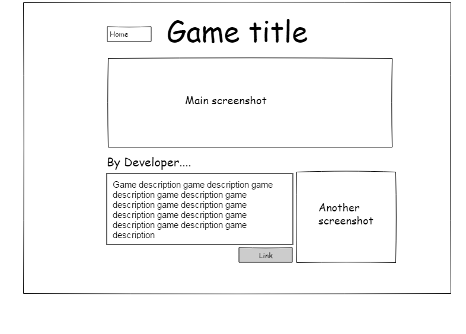
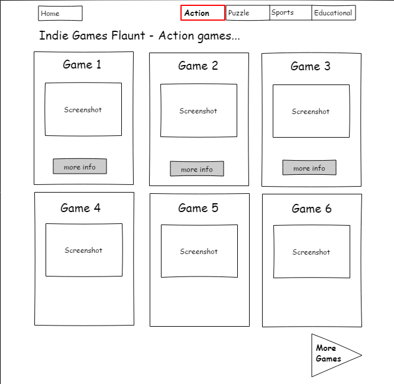
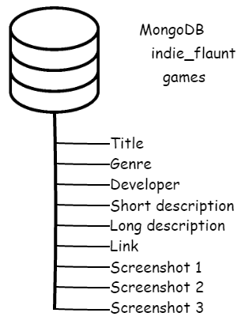
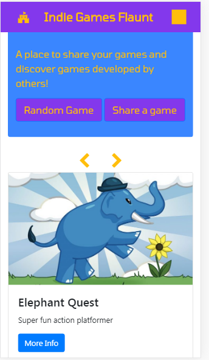
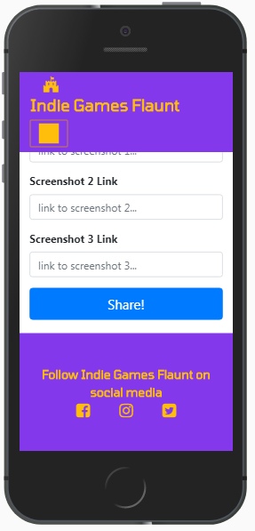
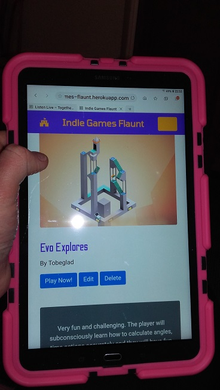

# Indie Games Flaunt #

Indie Games Flaunt is a website developed with two main purposes:

1. To provide a central location where indie game developers can share their games.
2. To provide a central location where indie game fans and casual gamers can find the latest indie games as well as older releases.

## Terms ##

*flaunt* - display (something) ostentatiously, especially in order to provoke envy or admiration or to show defiance.

*Indie game* - a video game, commonly created by an individual or a small team without the support of a video game publisher.

**The problem**

Indie games are mostly found on dedicated websites that cater to the needs of developers as opposed to casual users. These sites (usually forums) are aimed at computer savvy individuals and as such can be off putting to more casual users - the interfaces can be difficult to navigate and can be difficult to use on mobile devices. These forum site are also quite fractured - many different websites to share indie games results in some games going undiscovered or at the very least, having a very limited audience.

**Proposed solution**

This website aims to be a central location where all of the latest indie game releases can be shared by both developers and players. Using this website, developers can be confident that their game will reach the largest audience and players can be confident that they have access to all of the latest releases as well as having access to all of the older releases. The website should be responsive so as to work on as many devices as possible - meaning the largest audience as possible can be targeted.

## UX ##

**External user goals**

1. A casual game player can browse the site and download a game they wish to play.
2. A game developer can share their game.

**Site owners goal**

Promote indie game development by providing a website where developers have access to a large audience of casual game players. Provide entertainment to casual game players as well as indie game fans by providing them with information such as links and screenshots for all of the latest games as well as previously released games.

## User stories ##

User story 1: As a casual video game player, it is great that there is a central hub of information about all of the latest indie game releases. The website allows me to easily select and play any game I am interested in.

User story 2: As an independent game developer, it is great to have a website where I can share my work with the community. The interface makes it easy for me to share the location of my game as well as a description.

User story 3: As a casual games player with little free time, I like to play games whilst commuting. The website, with its responsive interface allows me to browse and play the latest indie game releases on my smartphone.

User story 4: As an indie game developer, I noticed that one of my games posted on the website had a broken link. I used the edit button to update the information in the "link" field.

## Design & prototyping ##

The central design goal of the website is to be easy to use for casual gamers - intended to be the largest visitor demographic. As such, it is designed with mobile as well as desktop devices in mind. The user interface is easy to navigate on a multitude of devices.

Below we see an early mock up of the design on a desktop computer. Note the large, standout text and relative lack of clutter.

Image 1. Early design

A Bootstrap template was selected, titled "Heroic Features". It appears to have much of the intended layout goals already implemented out of the box such as the nav bar, bold text and responsiveness.

Image 2. Heroic Features

Below we see the final chosen design for the main page. We see a Jumbotron as well as three cards. What is not clear from the image is that the cards are intended to be housed within a carousel object. This will allow the user to scroll and cycle through all of the games available in the database.

Image 3. Wireframe of the main page as seen from a desktop computer

Below we see the main page as it should look from a smartphone.

Image 4. Wireframe of the main page as seen on a smartphone

**Dedicated game screen**

Here we see a mock up of what the user will see if they were to click on a particular game. The game's title is displayed in large letters along with a large screenshot.  A textual description of the game is displayed alongside another screenshot. The developers name is provided (this is also a link that points to all of the developers other games). The link to the game is provided at the bottom of the page. Not shown in this wireframe is functionality to share a particular game to a social media feeds such as Facebook and Twitter etc.

Image 5. Dedicated game screen on a desktop computer

Below is the dedicated game screen as seen on a mobile device

Image 6. Dedicated game screen on a mobile device

Below we see a mockup of what will happen when a user clicks one of the navbar links. The user will be taken to a page that lists all of the game available in that particular category. In this case, the imaginary user has clicked on the "action" category and is presented with a list of all the action games currently in the database.

Image 7. All games of a particular category, desktop view

Below we see a mockup of the same screen except this time on a mobile device.

Image 8. All games of a particular category, mobile view

Below we see a mockup of the "share game" screen. Here a user will enter the details of a game such as its title, developer and some screenshots of the game. Upon clicking submit, the game will be posted to the database and be immediately viewable on the website.

Image 9. Share a game, desktop

Below we see the same functionality except this time on a mobile device.

Image 10. Share a game mobile

## Database design and implementation ##

Below we see a plan of what data will need to be held by the database.

Image 11. Database planning

**Data types**

The database will be required to hold textual information. The game title, genre, developer and description are all simple text. The link to the game as well as the screenshots are hyperlinks. These will be stored as text be processed accordingly by HTML tags.

Title (text): the games title.

Genre (text): can be either action, puzzle, sports or educational.

Developer (text): the name of the games developer.

Short description (text): A short description of the game to be used on the cards on the main screen.

Long description (text): A full description of the game which is viewable when the user clicks the "More info" button to see a full breakdown on the game.

Link (text): A link to the game. This could either be a link to a web based game or a direct download link.

Screenshot 1,2,3 (text): A url to an image of the game.

**Database setup (development)**

1. An account was created on [https://cloud.mongodb.com](https://cloud.mongodb.com)
2. A database was created called `IGF_DB` (short for Indie Games Flaunt database)
3. Inside this database, a collection called 'IGF_COLL was created. This collection stores all of the documents that represent each game in the database.
4. The connection string was copied from the 'connections' screen on the MongoDB website.
5. The connection string was hard coded into the `app.py` file.
6. In the network setting dialog on the MongoDB website, a 'whitelist' IP adress of `0.0.0.0/0` was assigned to the database - this allows outside traffic (such as Heroku) to have access to the database.

**Database setup (deployment)**

1. In order for the database to be secure for deployment, the hard coded connection string was removed.
2. The connection string was added to the hosts enviornment variable (in this case Heroku)
3. The application was set to read the connection string from the hosts enviornment variable. Deployment with this method means that the password and username of the database is not exposed to the public.

## Theme ##

As the website is to be used to host video games and is to be used by persons who are interested in video games, it was decided that the look and feel of the website should be inspired by video games and their history. The text fonts chosen wel selected because they evoke 80's computer aesthetic.

**Color scheme**

The color palette below is that of the Nintendo Entertainment system. From this palette, five colours were chosen to be used throughout the site. This palette was chosen in the hopes of evoking a 80's/90's video game feel.

Image 12. Color palette from the Nintendo Entertainment System

The website 'Coolors' was used to generate a five color palette based on the nes palette above.

Image 13. Final chosen palette

## Features ##

**Carousel of cards**

On the main screen all games are displayed on an interactive carousel containing cards that have short description and screen shot. The cards contain a button that will link the user to a more detailed description of the game. The carousel can be scrolled by clicking the left and right arrows on top of and below the carousel. The arrows are implemented twice in order to allow better user experience of mobile users who would otherwise have needed to scroll to the top of the screen every time that want to change a slide.

**Share a game**

Users can click the share button and enter the details of a game they wish to share with the community.

**Social media links**

The website contains links to the Indie Games Flaunt social media pages.

**Responsive design**

The website works on both mobile and desktop devices meaning the largest possible target audience can be obtained.

**Random game**

The random game button on the main screen sends the user to a dedicated game screen of a random game contained in the database.

**Edit a game description**

On the dedicated game page for every game, the user can click the edit button to allow them to change the details of any games in the database.

**Delete a game from the database**

A user can select a game and from its dedicated page, press the delete button to remove it from the database.

**Features left to implement**

- Implement user profiles giving each user an account with the website. This will allow much more robust functionality such as games only being edited by the user who submitted that game.
- Implement authentication. At present, there is no authentication on the forms. This means that a user can submit a game with some fields missing such as a title.
- Implement a feature that allows users to upload their own screenshots of games. At present, the site is limited to only allowing url's of images already uploaded to be used.
- Images should be fixed to a certain size to allow more uniform page layouts.
- The buttons that progress the carousel are not responsive at the moment, this needs to be fixed.
- The four categories of games currently have their own HTML file. The websites codebase would be more maintainable if these pages used a base HTML file.
- A confirm dialog should be implemented for when users click the delete button.

# Technologies Used #

**Flask**

The Flask web application framework was used for the development of the site. Flask allows the use of Python to dynamically build web pages. It also features a simple server that allowed convenient testing of the site locally during development.

Flask link:

[https://www.palletsprojects.com/p/flask/](https://www.palletsprojects.com/p/flask/)

**Gunicorn**

Although Flask has its own built in web server, it is rather limited. Gunicorn is a web server specifically designed to work with the Python language. Use of Gunicorn greatly reduced the complexity of deploying the website on Heroku.

Gunicorn link:

[https://gunicorn.org/](https://gunicorn.org/)

**MongoDB**

MongoDB is a database solution that stores data in the form of 'documents'. Each document contains an unique id number and can hold any number of fields of many different types of data such as text and numbers. It was used in this application to hold data on each game such as developer information and screenshots.

MongoDB link:

[https://www.mongodb.com/](https://www.mongodb.com/)

**Heroku**

Used to host the deployed website so that it is accessible to the outside world.

Heroku link:

[https://www.heroku.com/](https://www.heroku.com/)

## Font Awesome ##

Font Awesome is linked via CDN to provide the icons used throughout the website. The "fort" icon (https://fontawesome.com/icons/fort-awesome?style=brands) looks similar to the iconic castle in the Super Mario Bros. franchise. This was chosen as the home button as it fit the theme of the website very well.

Font Awesome link:

[https://fontawesome.com](https://fontawesome.com)

## Coolors ##

Coolors is a color scheme generator that outputs a five colour palette of complementary colors based on some initial inputs. The output contains information on the RGB and hex values used in the palette.

Coolors link:

[https://coolors.co/](https://coolors.co/)

## Pencil ##

The Pencil prototyping tool was used to create the wireframes seen in this document.

Pencil link:

[https://pencil.evolus.vn/](https://pencil.evolus.vn/)

## Computer languages ##

Django, HTML, CSS, Javascript, Python, Markdown.

## Git & GitHub ##

Used for version control.

GitHub link:

[https://github.com](https://github.com)

## Heroic Features ##

Bootstrap template used for the main page layout by Start Bootstrap.

Heroic Features link:

[https://startbootstrap.com/templates/heroic-features/](https://startbootstrap.com/templates/heroic-features/)

## Small Business ##

Bootstrap template used for the dedicated game page layout by Start Bootstrap.

[https://startbootstrap.com/templates/small-business/](https://startbootstrap.com/templates/small-business/)

## Notepad++ ##

Text editing software used for all coding tasks.

Notepad++ link:

[https://notepad-plus-plus.org](https://notepad-plus-plus.org)

## Tomorrow font ##

Described by its creator as:

"Tomorrow is a geometric family ranging from a neutral Thin weight to a vibrant contrast-based Black. It is an excellent fit for small sizes and big headlines. Easy to read and hard to forget."

Tomorrow link:

[https://github.com/MonicaRizzolli/Tomorrow](https://github.com/MonicaRizzolli/Tomorrow)

## Odibee Sans font ##

Odibee Sans link:

[github.com/barnard555/odibeesans](github.com/barnard555/odibeesans)

# Testing #

The website was tested on various devices with a number of different screen sizes and operating systems. The website was found to respond well in all tests. Below are some images of various devices tested.

Image xxx. Running on a Pixelx2 device (emulated)

Image xxx. Running on an IPhone5 device (emulated)

Image xxx. Running on an Android tablet in portrait screen orientation

Image xxx. Running on an Android tablet in landscape screen orientation

Image xxx. Running on an Android phone

**Other tests**

**Test 1 - Action link**

1. Go to the main page.
2. Click the "Action" link in the navbar.
3. The user should be directed to a page containing a list of all the games that are stored under the category "action".

**Test 2 - Puzzle link**

1. Go to the main page.
2. Click the "Puzzle" link in the navbar.
3. The user should be directed to a page containing a list of all the games that are stored under the category "puzzle".

**Test 2 - Sports link**

1. Go to the main page.
2. Click the "Sports" link in the navbar.
3. The user should be directed to a page containing a list of all the games that are stored under the category "sports".

**Test 2 - Educational link**

1. Go to the main page.
2. Click the "Educational" link in the navbar.
3. The user should be directed to a page containing a list of all the games that are stored under the category "educational".

**Test 3 - Random button**

1. Go to the main page.
2. Click the "Random" button.
3. The user should be directed to a page containing all of the details of a game stored in the database.
4. Click the "Home" button.
5. Again click the random button.
6. The user should be again directed to a page containing all of the details of another game stored in the database.

**Test 4 - Share button**

1. Go to the main page.
2. Click the "Share" button.
3. The user should be directed to the "share.html" page.
4. Click the "home" button.
5. The user should be directed to the main page and no information should have been added to the database.

**Test 5 - Sharing a game**

1. Go to the main page.
2. Click the "Share" button.
3. The user should be directed to the "share.html" page.
4. Enter the details of a game.
5. Click the share button.
6. The user should be directed to the main page and the game details submitted should now be visible on the main page.
7. Click the category of game entered in step 4 on the navbar.
8. The game that was entered should now be visible on the bottom of the list in the category page.

**Test 6 - Deleting a game**

1. Select a game from the main page.
2. Click the delete button.
3. The user should be directed to the main page. From here, confirm that the game delted in the previous step has in fact been deleted.
4. The game should not be available for viewing.

**Test X - Navigation**

1. Go to the main page
2. Click the link on the navbar entitles 'Action'
3. The user should be redirected to the page that contains all of the games in the Action category
4. Click the Home icon on the navbar
5. The user should be redirected to the main page once again
6. Click the link on the navbar entitles 'Puzzle'
7. The user should be redirected to the page that contains all of the games in the Puzzle category

**Test 7 - Editing a game (no changes made)**

1. Go to the main page
2. Click on the Action category.
3. Click on the first game in the Action category.
4. Click the edit button
5. Once in the edit screen, note the values in each field
6. Now click the Home button
7. Again, click the Action category and again click the first game listed
8. The values should not have changed since last viewed

**Test 8 - Editing a game (changes made)**

1. Go to the main page
2. Click on the Puzzle category.
3. Click on the first game in the Puzzle category.
4. Click the edit button
5. Once in the edit screen, note the value of the 'title' field
6. Change the value in the title field to 'New Title'
7. Click the edit button. You will be redirected to the main page.
8. From the main page, click the Puzzle category and again click the first game listed
9. The title of the game should now be 'New Title'

**Tests 8, 9, 10 - Social media links**

1. Go to the main page
2. Click the Facebook icon
3. A new tab should open with the address for the Facebook website
4. Close the Facebook tab and return to the main page
5. From the main page, click the 'Sports' category
6. From the Sports page, click the Instagram Icon
7. A new tab should open with the address for the Instagram website
8. Close the instagram tab and return to the main page
9. From the main page, cick the random game button
10. From the page that opens up, click the Twitter icon
11. A new tab should open with the address for the Twitter website

**Test 11 - Responsivness**

Run the website on multiple devices, the website should respond depending on the screen size of the various devices (see the images of this test under the Testing heading)

**Test 12, 13 - Feedback**

1. Go to the main page.
2. Hover the mouse over the links in the navbar, the social media links in the footer as well as the buttons in the jumbotron.
3. All of these elements should respond to the users hover. The links should grow larger whilst hovered over and the buttons should change colour whilst hovered over.

**Test 14 - User experience**

This test involved the participation of volunteers. The aim was to determine if the user interface was intuitive to a casual user.

The first volunteer was asked to navigate to the Action category using an IPhone. They were then to select one game and attempt to play that game. The user was able to cayy out these tasks with ease.

The second user was asked to select a random game by using the random button on the main page using a desktop computer. They were then asked to edit the title of that game by using the edit button. The user completed the task with relative ease but did  report that the text on the edit screen was hard to read. This test resulted in the darkening of text on the edit screen.

**Test X - Entering games with identical names**

It is not uncommon in the indie games scene for two or more games to share the same name. This test was designed to ensure the website would be able to handle such a situation.

1. Go to the main page
2. Click the share game button
3. Enter the following details

    "Title: Elephant Quest
    
    Developer: ArmorGames
    
    Genre: Action
    
    Link: https://elephant quest.com
    
    Short description: Super fun action platformer
    
    Description: Fast paced action game where the user controls an elephant that can fire laser cannons. Save the other elephants by shooting enemies and collecting powerups. Arrow Keys/WASD to move, mouse to shoot.
    
    Screenshots 1, 2 & 3: https://imgur.com/el1.jpg, https://imgur.com/el2.jpg, https://imgur.com/el3.jpg"

4. Repeat step 3 but enter a developer named `"other developer"`
5. Navigate to the "Action" category page.
6. The two games should be visible.
7. Click on each game and ensure they show that they were developed by different developers.

## Deployment ##

**Deployment (web)**

The following steps were taken to deploy the website online:

1. An account was created with Heroku.
2. A new Heroku app was created.
3. Gunicorn server was installed with the command: `$ pip install gunicorn` See above for more information regarding Gunicorn.
4. A file named "Procfile" was created containing information about Gunicorn that is needed by Heroku.
5. The heroku app was linked to the GitHub repository of Indie Games Flaunt.
6. Heroku was set to automatically update with each commit.
7. From the MongoDB website under the network access tab, an IP address of 0.0.0.0/0 was entered for the website's database. This IP address is what is known as a whitelist IP meaning that all traffic will be allowed to interact with the database (including Heroku)
8. An enviornment variable was added to the Heroku app for the website with the key "MONGO_URI". This key contains values that link to the websites database as well as password details. Having the database access restricted to this enviornment variable keeps the data safe.

**Deployment (local)**

In order to deploy this website on a local machine, the following steps would need to be taken:

1. A MongoDB database and collection would need to be created.
2. This databases connection string would need to be copied from the MongoDB website by navigating to the connection string tab.
3. Edit this connection string by replacing `<password>` with your own password and replacing `test` with the name of the database created in step 1.
4. Edit the following line in app.py: `app.config["MONGO_URI"] = os.getenv("MONGO_URI")`
replace the text after the `=` with the modified connection string from step 3.
5. Open a command window and set the `FLASK_APP` enviornment variable to `app.py` by running the following command: `set FLASK_APP=app.py`
6. Now run Flask's built in server by typing the command `flask run`
7. The website will now be available on the local host address `127.0.0.1:5000`
8. Initially, the website will not show any games. This is because the database is empty. Click the Share Game button to begin adding games.

## Credits ##

Thanks to the Code Institute team & mentor's Spencer Barriball & Simen Daehlin. Thanks also to Code Institute student Anna Greaves.

